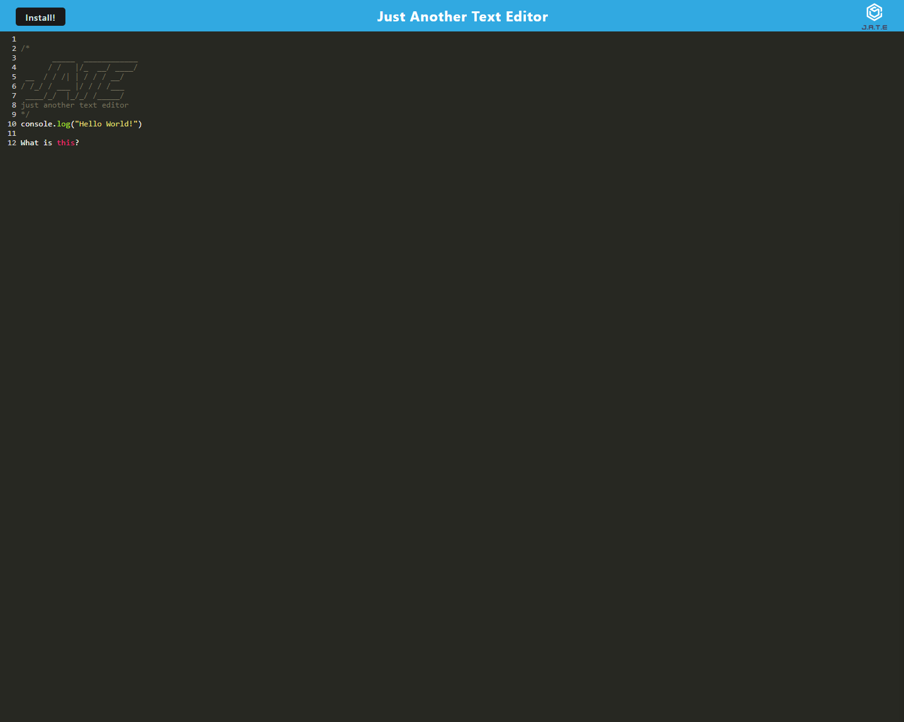
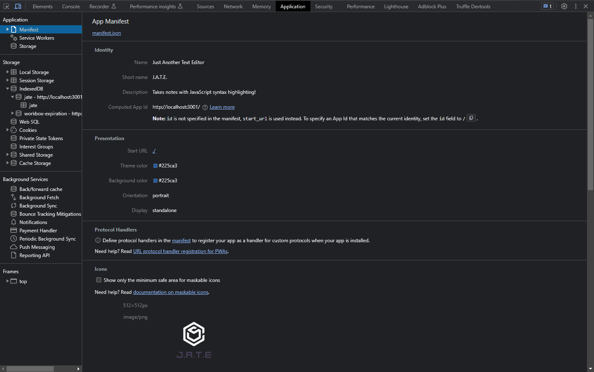
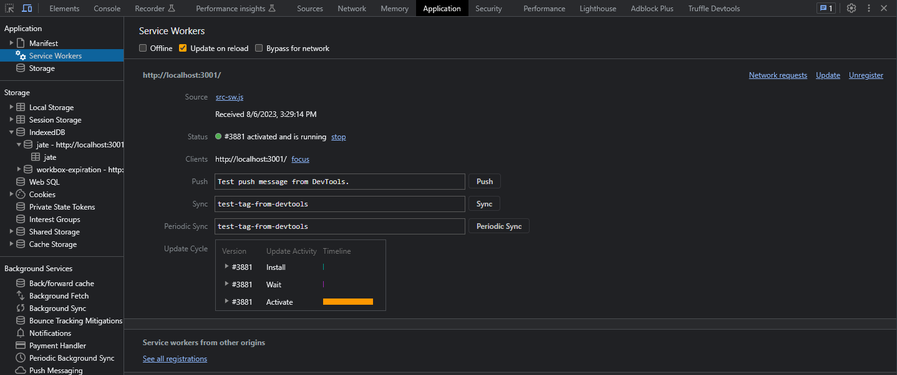
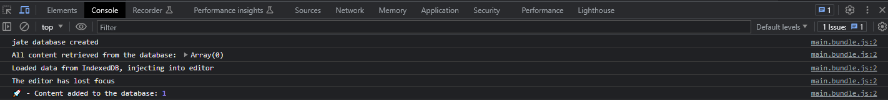

# Text Editor

## Description

'JATE' is a text editor that runs in your browser. The app is a single-page application PWA and will also function offline.

## Table of Contents:

[Installation](#installation)

[Usage](#usage)

[Contributing](#contributing)

[Questions](#questions)

## Application

The application is available to try on [Heroku!](https://afternoon-crag-68772-a25ff27e0a52.herokuapp.com/)

The text editor single page application:


The manifest is stored in the application tab of the developer tools (F12).


The service workers are stored under the application tab as well:


Make sure to check the consolel logs to see if the database was created properly! It should look like this when you first open it up:


## Installation

First, download this repository.

Open your terminal and direct into the Text-Editor folder

Run this command in your terminal:

```
npm run install
```

## Usage

To use the application, start the application by running: 

```
npm run start
```

## Contributing

This is a closed project, you are welcome to fork this repository or download these files to your own local storage to modify.

## Questions?

If you have any questions, please reach out to [RandyYanish](https://github.com/RandyYanish) at rtaylorfargo@gmail.com.
